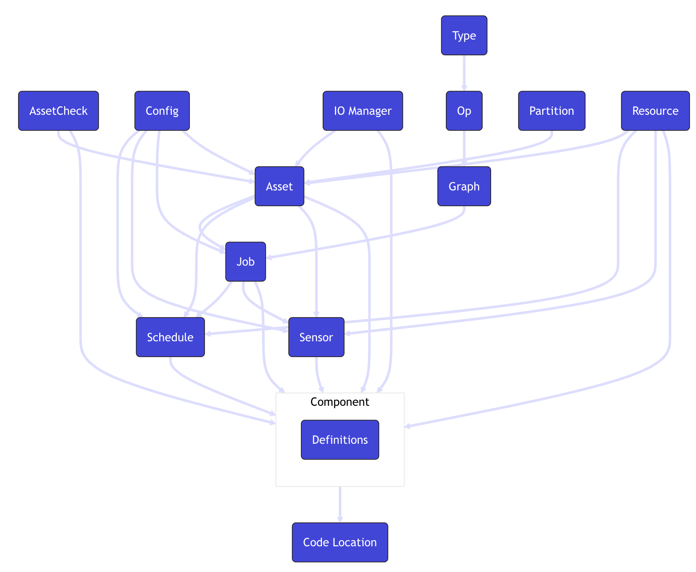

# Data Orchestration with dagster


## What is dagster? 
- data orchestrator 
- automate data pipeline
- produce data assets
- Software Defined Assets(SDA) [Read More](https://dagster.io/glossary/software-defined-assets)
  - define assets and their relationships 
  - execution plan inferred from these definitions
  - declarative programming (ex.sql) (vs imperative programming (ex.pandas))
- benefits for asset-centric approach
  - manage dependencies
  - monitor execution

>[!Note]
>Check out the [link](https://dagster.io/glossary/software-defined-assets) to read more about SDA and a simple example of how dagster uses assets to build a data pipeline

## Core concepts

With dagster, a data pipeline orchestration is built by components of ```asset```, ```job```, ```schedule``` and ```sensor``` etc. In a python script, ```definitions``` is used to collect these components to build a workflow. The ```definitions``` will be then deployed for materializeion. 
  
dagster components: 
[](https://docs.dagster.io/getting-started/concepts)

### Asset
- a logical unit of data like a database table, a csv file, a png file etc...
- an ```asset``` can has dependencies on other ```asset```
- an ```asset``` can be used in a ```job```, ```schedule``` or ```sensor```

### Job
- the main form of execution
- contain a selection of ```asset```
- can be scheuled by ```schedule``` or triggered by ```sensor```

### Scheule
- a way to automate ```job``` or materialization of ```asset``` at a specific interval
- after deployment, the automation needs to be started in dagster UI

### Sensor
- a way to trigger ```job``` or materialization of ```asset``` when an certain event occur
- after deployment, the automation needs to be started in dagster UI

### Definitions
- ```Definitions``` is a top-level construct in a workflow
- only objects included in the definitions will be deployed and visible within dagster UI


## Installation 

Installing the python packages below to your uv virtual environment:

```bash
uv pip install dagster dagster-webserver
```

## Command
To start a dagster local development server and load definitions from a python file:

```bash
dagster dev -f <python file>
```


## Hands-on exercise

Create a pipeline to create the below components following the order:
- a `asset`to read *sample_data.csv*,
- a job to materialize the data `asset`,
- a schedule to schedule to job above,
- a `asset` to plot a matplotlib graph,
- a job to materialize the plot `asset`,
- a sensor to start the job above whenever the data `asset` is materialized
- a `definitions` to collect all the above components for deployment

After the deployment, check the dagster UI to understand different components


# References
Materialis from this lecture comes from these official documentations from dagster: 
- [dagster overview](https://dagster.io/blog/dagster-crash-course-oct-2022)
- [dagster components](https://docs.dagster.io/getting-started/concepts)
  

