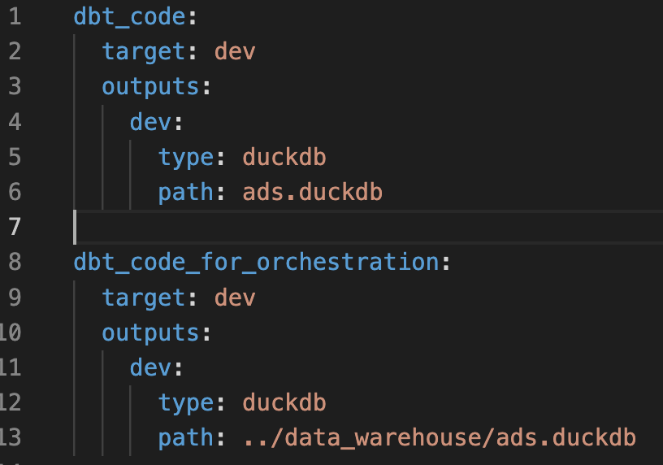

# Data Orchestration with dagster


## Create a dagster pipeline with the components below:
- a `dlt resource` and `dlt asset` to stage Jobtech API data,
- a job to materialize `dlt asset`,
- a schedule to schedule to job above,
- a `dbt resource` and `dbt asset` for data transformation,
- a job to materialize `dbt asset`,
- a sensor to start the job above whenever `dlt asset` is materialized
- a `definitions` to collect all the above components for deployment

Then, streamlit app outside this orchestration will always fetch the latest data from data warehouse.


## Installation 

Installing the python packages below to your uv virtual environment:

```bash
uv pip install dagster-dlt dagster-dbt
```

## dbt profile

For this dagster pipeline, we are using the dbt profile, *dbt_code_for_orchestration*, in `profiles.yml`:




# References
Materialis from this lecture comes from these official documentations from dagster: 
- [dagster dlt](https://docs.dagster.io/integrations/libraries/dlt)
- [dagster dbt](https://docs.dagster.io/integrations/libraries/dbt)
  

