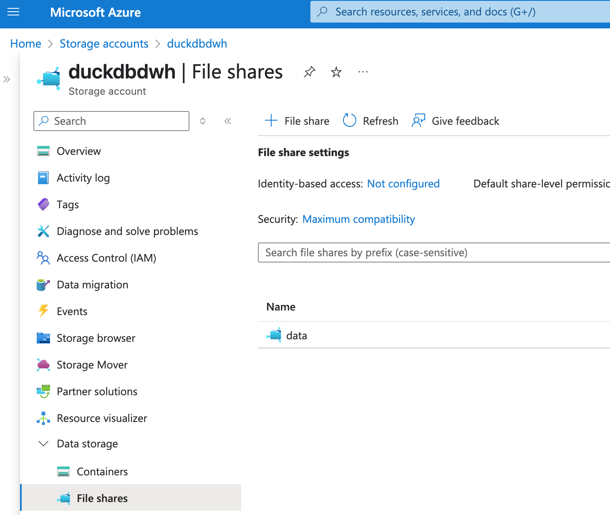

# Cloud Deployment of the entire data pipeline: Docker and Azure

## Purpose 
In this lecture, we will use docker to produce two containers:
- dlt-dbt-dagster orchestration pipeline
- streamlit visualization app
  
They will be then deployed in different Azure resources so that the entire data pipeline will be in the cloud. 

*TODO- tutorial video to be added*
 
*TODO- detailed steps to be added*

## Snapshots of the steps:

Step 1: Containerize the dlt-dbt-dagster orchestration pipeline

Step 2: Containerize the streamlit visualization app

Step 3: Set up Azure FileShare

Step 4: Push docker images to Azure Container Registries

Step 5: Spin up Azure Container Instance for dlt-dbt-dagster orchestration

&rarr; Dagster UI is then available on the Container Instance!

Step 6: Set up Azure Web App for the streamlit visualization

&rarr; Streamlit app is now deployed on Web App!

